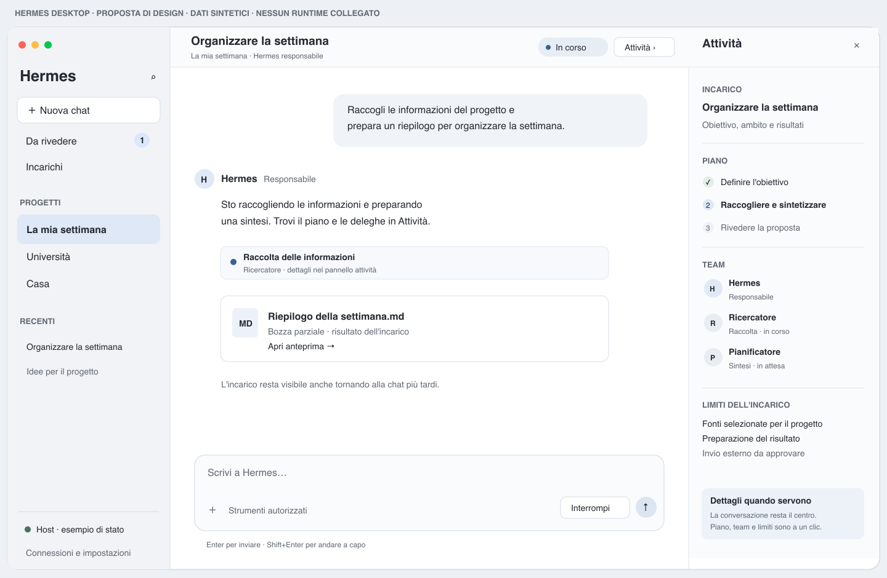

# Hermes Studio

Fondazioni per un'app desktop Hermes dedicata ad assistente personale e progetti, con agenti collaborativi e incarichi persistenti. Questo repository contiene ricerca, proposta di design, setup delle skill e backlog, oltre al primo incremento del client macOS; le integrazioni runtime non sono ancora implementate.

## Da dove iniziare

| Documento | A cosa serve |
|---|---|
| [Memoria del progetto](docs/project/MEMORY.md) | Decisioni confermate, domande aperte e istruzioni di ripartenza |
| [Stato](docs/project/STATUS.md) | Cosa è completato, cosa manca e cosa è da decidere |
| [Spec proposta](.scratch/hermes-desktop/spec.md) | Scopo, storie utente e criteri di successo |
| [Design](docs/design/desktop-design.md) | Componenti, interazioni, stati, motion e accessibilità |
| [Wireframe](docs/design/desktop-wireframe.svg) | Composizione proposta con dati sintetici |
| [Roadmap](docs/project/ROADMAP.md) | Milestone, rischi e dipendenze |
| [Backlog](.scratch/hermes-desktop/issues/) | Otto ticket draft, uno per risultato |
| [Pattern Unsloth](docs/ux-extracts/unsloth/pattern-library.md) | Osservazioni con schermate e limiti |
| [Contratto runtime](docs/architecture/runtime-contract.md) | Integrazione desiderata e capacità da verificare |
| [Skill e workflow](docs/agents/skills-workflow.md) | Cosa è installato e quando usarlo |
| [Fonti](docs/research/sources.md) | Evidenze e versioni della ricerca |
| [Registro continuo](docs/project/WORKLOG.md) | Risultati salvati durante il lavoro |

## Wireframe iniziale — storico



Baseline iniziale: progetti nella sidebar e conversazione centrale. L’utente ha poi scelto team principale, chat secondaria e avatar illustrati; vedere la memoria per la composizione in discussione. Il wireframe illustra le responsabilità delle aree: non simula un runtime reale e non prova le capacità dell'integrazione.

## Prima consegna da realizzare

Una chat Hermes reale che invia, riceve in streaming, si interrompe e si ritrova dopo la riapertura. Prima verificare il riuso del desktop upstream e scegliere il protocollo; poi introdurre incarichi, approvazioni, delegazione e host sempre acceso. Le scelte tecniche e i ticket sono bozze per la revisione.

## Persistenza del lavoro

Su richiesta dell'utente, aggiornare stato, registro e file interessati dopo ogni blocco significativo. Le skill sono installate a livello di progetto e la guida di continuità è in `AGENTS.md`. Nessun provider, gateway o database Hermes personale è stato riconfigurato.

## Build locale

```bash
bash scripts/build-app.sh
bash scripts/check-persistence.sh
open build/Hermes.app
```

SDK 26.5 locale selezionato nello script; impostare HERMES_MACOS_SDK per un SDK compatibile alternativo. Bundle ad hoc per sviluppo, non notarizzato. Nessun accesso al profilo Hermes personale.
