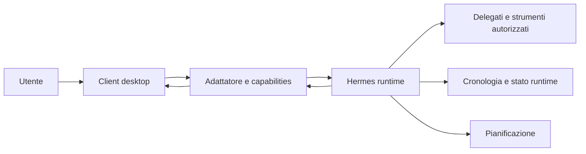

> Numerazione storica: gli ID nel testo precedono il riordino; i link alle schede puntano ai file attuali. [Corrispondenza vecchi/nuovi ID](../features/numbering-2026-10-04.md).

> Documento/evidenze storici. Per stato corrente leggere [STATUS](../project/STATUS.md); requisiti e gate attuali nel [catalogo feature](../features/README.md). Il contenuto sotto non autorizza nuove attività né certifica lo stato successivo a F00.

# Contratto client–runtime: proposta e verifica

2026-10-04. Stato: proposta, nessuna chiamata a un runtime personale effettuata. Fonte primaria: [Programmatic Integration Hermes](https://hermes-agent.nousresearch.com/docs/developer-guide/programmatic-integration). Questa è una specifica dell'adattatore desiderato, non una nuova API già esistente.

## Confine

Il client presenta conversazioni, incarichi e risultati. Il runtime Hermes esegue il lavoro. L'adattatore traduce il protocollo disponibile in eventi e operazioni stabili per il client. Prima scegliere versione e superficie upstream da riusare; poi congelare le fixture del contratto.

La separazione è logica: non implica microservizi multipli. Un servizio di incarichi separato si introduce solo se mancano primitive upstream adatte. Il trasporto locale/remoto è una scelta del ticket 01, non nascosta dietro la UI.

## Opzioni da confrontare

| Opzione | Vantaggio per questo progetto | Verifica necessaria |
|---|---|---|
| Desktop Hermes upstream | Superficie già integrata con il runtime | Licenza, componenti, build, distanza dal design richiesto |
| TUI gateway JSON-RPC | Controllo dettagliato di sessioni e richieste | Ciclo di vita indipendente dal client, trasporto remoto, compatibilità versione |
| API HTTP/SSE | Trasporto semplice per client locale e remoto | Capacità effettive di run, stato, replay e approvazioni |
| ACP | Protocollo per client agenti | Copertura del lavoro persistente e delle deleghe richieste |

Preferenza preliminare per un client nuovo: API HTTP/SSE se supera tutte le prove; TUI gateway se la sua copertura è necessaria. Evitare due trasporti simultanei nell'MVP senza una necessità dimostrata.

## Matrice delle capacità

Tutti i riferimenti sotto sono **documentati upstream**, non confermati nell'installazione locale. Non collegare la UI a nomi di metodo senza verificare payload ed errori sulla versione scelta.

| Necessità | Candidato upstream | Stato del progetto |
|---|---|---|
| Rilevare capacità | API capabilities / gateway capabilities | Da collaudare |
| Avviare/vedere un'esecuzione | Run API / prompt e stato sessione | Da collaudare |
| Streaming | SSE lifecycle / eventi JSON-RPC | Da collaudare |
| Interrompere | Stop run / interrupt sessione | Semantica e conferma da collaudare |
| Dare direzione | Steer run / steer sessione | Supporto e timing da collaudare |
| Approvazioni | Approval run / richiesta JSON-RPC server→client | Scadenza, replay e rifiuto da collaudare |
| Cronologia e ricollegamento | Session history/resume ed eventi | Copertura per ogni trasporto da collaudare |
| Delegazione | Controlli e stato delegati nel gateway | Mappatura API e provenance da collaudare |
| Pausa durevole del lavoro | Nessuna semantica già verificata | UI non disponibile finché provata |
| Incarichi ricorrenti | Scheduler Hermes | Gestione client e recupero da progettare |

## Operazioni desiderate dell'adattatore

Scoprire capacità, elencare/creare/leggere conversazioni, inviare un messaggio, osservare una esecuzione, interromperla, risolvere una richiesta, recuperare uno snapshot e aprire un risultato. Modificare un incarico o una pianificazione richiede supporto upstream verificato oppure una funzione del progetto con confine esplicito.

Ogni operazione restituisce un'identità stabile e un esito verificabile. Il successo locale dell'invio non equivale all'ammissione durevole del runtime. Se il trasporto non garantisce idempotenza, non ritentare automaticamente un comando di esito incerto: recuperare prima lo stato e mostrare l'incertezza all'utente.

## Eventi normalizzati desiderati

- Messaggio ammesso, frammento di risposta, messaggio completato.
- Attività iniziata/terminata, errore recuperabile/non recuperabile.
- Stato dell'esecuzione cambiato, delega aggiornata.
- Richiesta utente aperta, ritirata o risolta.
- Risultato disponibile.

Envelope desiderato: ID evento, identità conversazione/esecuzione, tipo, versione schema, timestamp, payload e cursore quando disponibile. Non fingere che tutti i protocolli offrano già questi campi: l'adattatore dichiara quali sono upstream e quali sintetizzati localmente. Un timestamp non stabilisce l'ordine; usare cursore o sequenza quando esistono.

## Ricostruzione e conflitti

All'avvio leggere capacità, snapshot, cronologia e richieste aperte. Al ricollegamento riprendere dal cursore se supportato; altrimenti riconciliare con snapshot autorevole e deduplicare. Un gap di eventi produce refresh, non un falso messaggio completato.

Una richiesta risolta altrove è ritirata qui. Le richieste hanno identità e scadenza; una risposta tardiva non deve autorizzare un'azione differente. L'interruzione mostra stato pending finché confermata. In caso di perdita di connessione il client conserva l'ultima osservazione marcata come tale, senza indovinare l'esito.

La documentazione distingue sessioni live del processo e trascrizioni salvate: una conversazione riapribile non prova che un'esecuzione possa riprendere dopo un riavvio. Sono due test diversi. L'host unico resta proprietario di una esecuzione; evitare processi indipendenti che scrivono sulla stessa sessione.

## Dati e segreti

Il runtime rimane proprietario di cronologia e credenziali provider. Il client conserva endpoint, credenziale di collegamento sicura, preferenze e bozze. Memoria, dati di progetto e file sono selezionati esplicitamente per incarico. Un allegato viene inviato solo dopo l'azione dell'utente e con destinazione nota.

In sviluppo usare un profilo/area dati Hermes dedicato e contenuti sintetici. Nessuna migrazione o scrittura diretta nella home personale. I log di progetto registrano capability ed errori redatti, non token, prompt sensibili o segreti. Il runtime remoto richiede autenticazione e trasporto protetto; nessuna esposizione pubblica fa parte di queste fondazioni.

## Checklist del ticket 01

Verificare sullo stesso runtime: versione, capacità, payload ed eventi, stato autorevole, persistenza trascrizione, richieste aperte, interruzione, riconnessione, chiusura del client e recupero dopo riavvio. Documentare separatamente ciò che manca e il costo di aggiungerlo. Poi aggiornare gli ADR proposti e la spec.
