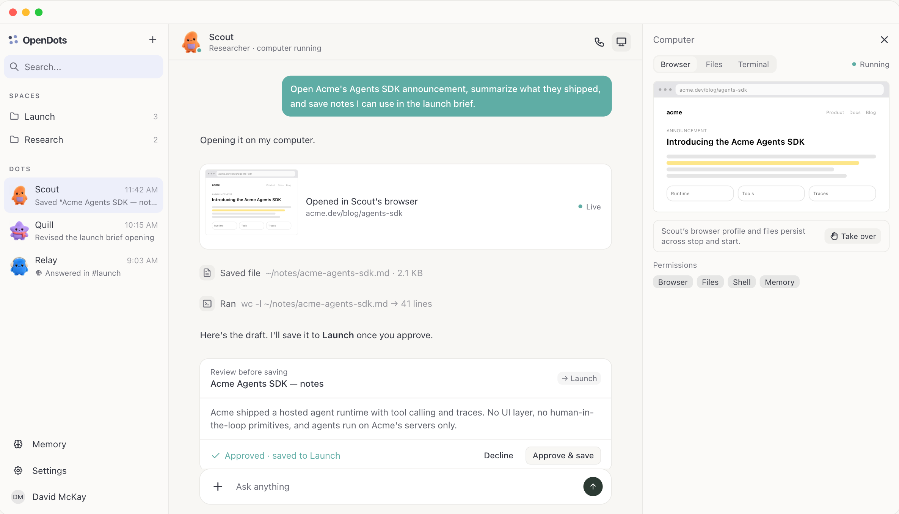

# OpenDots — riferimento visivo autorevole

2026-10-04. Luca richiede questa stessa esperienza e disposizione, non un redesign ispirato. Immagine originale copiata dalla cache allegati al progetto, integrità SHA256 verificata.

## Disposizione osservata nell'immagine

Finestra chiara con controlli macOS. Sidebar sinistra: logo e aggiunta, ricerca, Spaces con cartelle e conteggi, Dots con avatar illustrati, ultimo messaggio e ora; Memory, Settings e account in basso. Centro: header agente/avatar/ruolo e stato, azioni call e Computer, timeline conversazione, schede strumenti con anteprima e stato, ricevute file/terminale, scheda review prima del salvataggio nello Space, composer fisso in basso. Pannello Computer a destra: chiusura, tab Browser/Files/Terminal, stato Running, vista browser, Take over e permessi Browser/Files/Shell/Memory.

Tre colonne nell'immagine circa19%/53%/28%, da verificare nella finestra reale e adattare senza perdere gerarchia. Superfici avorio/chiare, testo grigio scuro, selezioni lavanda tenue, messaggi/stati verde acqua, card bianche con bordi sottili e raggi morbidi. Avatar costituiscono l'identità; non sostituirli con icone astratte. Titolo serif editoriale e team studio della proposta precedente sono superati.

## Regole di implementazione

Preservare disposizione, densità, comportamenti e accesso a Dots/Spaces/chat/memoria. I contenuti Acme/Scout dell'immagine sono dati dimostrativi, non stato reale Hermes: non simularne risultati o Running/Approved. Mantenere layout e mostrare stati realmente supportati dal backend. Chiamate telefoniche sono future: icona deve essere assente, disabilitata o spiegare indisponibilità finché non implementata.

La screenshot è riferimento prioritario anche se l'HEAD attuale OpenDots differisce (rail/sidebar e navigazione possono essere evoluti). Confrontare fonte e immagine, non assumere che clonare main produca esattamente questa schermata.

## Direzione tecnica

Obiettivo confermato: app desktop macOS, DMG e release. SwiftUI rewrite è una possibilità, non requisito rigido: scegliere il modo che conserva meglio l'esperienza mostrata. Valutazione corrente: riusare frontend OpenDots e pacchettizzare desktop, adattando il runtime a Hermes. Nessun obbligo di npm run dev per l'utente finale. Conservare precedente lavoro SwiftUI e trasporto come baseline, non eliminarlo.

Repository indipendente: proposta fork e aggiornamenti upstream annullata (D21). Preservare licenza MIT e provenienza del codice riutilizzato. Nessuna telefonata o credenziale voice da configurare in questa milestone.

## Requisiti funzionali aggiornati D25–D29

Layout screenshot resta autorevole, con semantica aggiornata: Spaces collegano cartelle e file reali F03/F10; Create/Edit Dot include scelta fra avatar OpenDots disponibili F04-A; Browser è pagina/profilo visibile condiviso con Hermes F08; Memory distingue profilo Hermes, Markdown Space e legacy Studio F15. Voce in-app e vocali F13 separati dalla telefonata futura: azione Start voice non simula Call disponibile. Componenti/stati restano gated dalla feature effettivamente implementata.
