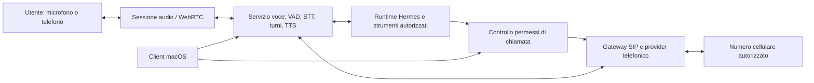

# Hermes vocale e chiamate al cellulare

Stato: **direzione futura e ricerca preliminare**; nessuna implementazione, installazione, configurazione telefonica o chiamata effettuata.
Aggiornato: 2026-10-04. Le fonti pubbliche sono state consultate in questa ricerca; integrazione e prestazioni sul Mac dell'utente non sono state provate.

## Intento

Hermes dovrebbe poter parlare con l'utente in tempo reale e, quando autorizzato, chiamarlo sul proprio cellulare come un assistente personale. La configurazione desiderata non deve richiedere una chiave OpenAI Voice né campi manuali per quel servizio. Questo documento conserva la direzione futura; non cambia le priorità di sviluppo correnti senza una decisione esplicita.

## Due esperienze distinte

| Esperienza | Trasporto | Cosa serve |
|---|---|---|
| Conversazione vocale dentro Hermes o in un client mobile | Audio locale / WebRTC | Microfono, riproduzione, sessione autenticata, motori vocali; per uso remoto anche server/rete disponibili. |
| Il telefono squilla al normale numero cellulare | SIP verso rete telefonica PSTN | Gateway e collegamento telefonico reale: tipicamente account/trunk di un operatore, identificazione chiamante abilitata e traffico telefonico. |

WebRTC da solo non chiama un numero telefonico. LiveKit documenta le chiamate verso numeri mediante trunk SIP e `CreateSIPParticipant`, con stato di chiamata e risposta del destinatario. L'outbound trunk contiene endpoint e credenziali del provider; il setup illustrato prevede un numero acquistato/configurato. Non si promettono chiamate mobili gratuite o senza account: numero, minuti e hosting vanno preventivati sul provider scelto. [Outbound calls](https://docs.livekit.io/telephony/making-calls/outbound-calls/), [Outbound trunk](https://docs.livekit.io/telephony/making-calls/outbound-trunk/).

## Componenti open source candidati — fatti documentati

| Componente | Ruolo verificato nelle fonti | Valutazione per Hermes, ancora proposta |
|---|---|---|
| **Pipecat** | Framework Python per pipeline vocali con servizi e trasporti modulari, incluso WebRTC. Il servizio Whisper documenta trascrizione offline CPU/CUDA/MLX senza chiamate esterne. | Prima opzione per gestire turni, audio e collegamento al runtime Hermes. Non usare il quickstart cloud come requisito del prodotto. |
| **MLX-Audio** | STT/TTS/STS su Apple Silicon, generazione TTS in streaming, modelli multipli e progetto Swift collegato. | Valutare Whisper/ASR e voce italiana compatibile, eventualmente Kokoro. Non equivale automaticamente a conversazione full duplex completa. |
| **whisper.cpp** | Inferenza Whisper locale C/C++, supporto Apple Silicon/Core ML. | Alternativa per STT integrabile in un servizio locale o client; il modello Whisper locale non richiede la API OpenAI. |
| **Piper** | Motore TTS locale; repository attuale GPL-3.0. Pipecat documenta un servizio Piper. | Alternativa leggera; controllare separatamente licenze del motore e delle voci prima di distribuirli. |
| **LiveKit SIP** | Bridge SIP/WebRTC open source, self-hosting documentato con LiveKit e Redis. | Scelta telefonica da confrontare dopo la prova vocale locale. Self-hosted non elimina il provider PSTN. |
| **Asterisk** | ARI permette applicazioni che manipolano canali e media, con API REST ed eventi. | Alternativa PBX se l'host dispone già di SIP/Asterisk; richiede un adattatore media/controllo, non basta un'impostazione GUI. |
| **Moshi di Kyutai** | Modello/framework vocale full duplex, backend MLX locale macOS quantizzato; backend PyTorch con requisito dichiarato di GPU da 24 GB. | Esperimento distinto: un modello vocale dialogante non eredita automaticamente strumenti, memoria e identità degli agenti Hermes. |

Fonti: [Pipecat](https://github.com/pipecat-ai/pipecat), [Whisper locale in Pipecat](https://docs.pipecat.ai/api-reference/server/services/stt/whisper), [MLX-Audio](https://github.com/Blaizzy/mlx-audio), [whisper.cpp](https://github.com/ggml-org/whisper.cpp), [Piper](https://github.com/OHF-Voice/piper1-gpl), [Pipecat Piper](https://docs.pipecat.ai/api-reference/server/services/tts/piper), [LiveKit SIP](https://github.com/livekit/sip), [Self-hosting SIP](https://docs.livekit.io/transport/self-hosting/sip-server/), [Asterisk ARI](https://docs.asterisk.org/Configuration/Interfaces/Asterisk-REST-Interface-ARI/), [Moshi](https://github.com/kyutai-labs/moshi).

## Architettura candidata — inferenza progettuale

Proposta iniziale: pipeline **STT locale → Hermes testuale → TTS locale**, con Pipecat per turni/trasporto. Mantiene il runtime Hermes responsabile del ragionamento, degli strumenti e della continuità. Il servizio voce deve mappare la sessione corretta, interrompere la riproduzione quando l'utente parla e distinguere interruzione audio da cancellazione del lavoro dell'agente. Un messaggio vocale non deve creare una nuova sessione ad ogni frase.

Il modello linguistico di Hermes resta quello configurato nel runtime. Eliminare OpenAI Voice non rende automaticamente locale anche il ragionamento: se Hermes usa un provider remoto, il testo trascritto destinato al modello lascia comunque l'host. L'integrazione descritta è da realizzare, non una capability già presente nell'app.

## Mac, latenza e disponibilità

MLX-Audio documenta Apple Silicon, Python 3.10+ e ffmpeg per alcuni formati; Moshi ha una variante MLX quantizzata. La dimensione dei pesi, il consumo di memoria unificata e la concorrenza con il modello Hermes vanno misurati sul Mac effettivo. Nessuna promessa di latenza “Jarvis” deriva dalla sola presenza di streaming nel README.

La prova deve misurare tempo fine-frase→prima risposta audio, qualità italiano, rumore/eco, interruzioni, memoria e stabilità. Una pipeline a turni con segmenti audio può essere interattiva senza essere un unico modello speech-to-speech full duplex. L'host deve restare disponibile per chiamare quando il client è chiuso; il Mac in stop non soddisfa da solo il requisito 24/7. Per SIP self-hosted la documentazione richiede connettività per signaling/media: rete, NAT e gestione operativa sono parte della futura scelta host, non cambiamenti autorizzati ora. [Requisiti MLX-Audio](https://github.com/Blaizzy/mlx-audio#requirements), [Moshi MLX](https://github.com/kyutai-labs/moshi#mlx-implementation-for-local-inference-on-macos), [LiveKit self-hosted SIP](https://docs.livekit.io/transport/self-hosting/sip-server/).

## Esperienza e permessi proposti

La GUI espone “Voce locale”, stato download/preparazione, voce/lingua, dispositivo audio, mute e termina. Preset gestiti dall'app possono evitare campi model/base URL manuali per la voce; i pesi e il backend esistono comunque e devono essere selezionati/versionati internamente. Credenziali SIP e numeri restano nel servizio sicuro dell'host, non nei prompt o nei documenti del progetto.

La chiamata deve essere una **capacità del runtime Hermes**, con il client come superficie per configurazione e conferme. Schema concettuale, non API esistente: richiesta di chiamare il proprietario con motivo, priorità, finestra temporale e limite di durata; controllo del permesso; avvio gateway; eventi autorevoli `dialing/answered/busy/failed/ended`; riepilogo con esito. “Richiesta accettata” non significa “telefono risposto”.

Ambito iniziale proposto: solo numero del proprietario verificato, limiti di frequenza/durata/spesa, orari concordati e autorizzazione esplicita alla regola che può attivare una chiamata. Nessuna chiamata a terzi o registrazione implicita. Audio grezzo non conservato per default; trascrizione e riepilogo seguono una preferenza esplicita. La parte telefonica attraversa il provider: non dichiarare end-to-end locale/privata la tratta PSTN. In ingresso, il caller ID da solo non è un'autorizzazione sufficiente per operazioni sensibili.

## Milestone future e prove

1. **PoC locale offline:** audio sintetico e poi microfono autorizzato, italiano, STT/TTS, cancellazione riproduzione e misure di latenza; nessuna telefonia.
2. **Bridge Hermes isolato:** continuità della sessione, strumenti e risultati con provenienza, timeout e interruzioni senza duplicare comandi incerti.
3. **Client audio remoto:** WebRTC autenticato, riconnessione, mute e chiusura; verificare rete/host senza confonderlo con chiamata cellulare.
4. **Scelta telefonia:** confronto LiveKit SIP/Asterisk, provider e tariffario effettivi, account/trunk/caller ID, privacy e permessi; nessun acquisto automatico.
5. **Chiamata pilota autorizzata:** solo numero dell'utente, limite concreto di costo/durata; risposta, occupato, mancata risposta, guasto e hangup verificati.
6. **Proattività e 24/7:** regole concordate per gli agenti, quiet hours, revoca, audit e prova su host sempre acceso. Soltanto dopo queste prove mostrare la capability nell'app.

## Domande aperte

- Solo chiamata in uscita al numero dell'utente oppure anche risposta alle sue chiamate?
- Mac locale o host dedicato per voce e telefonia quando il Mac dorme?
- Priorità italiana, voce sintetica standard e budget mensile telefonico?
- Quando gli agenti possono chiamare: solo comando diretto oppure eventi importanti entro regole concordate?

La ricerca non costituisce autorizzazione a scaricare modelli, aprire porte, creare account, registrare audio o effettuare chiamate.
