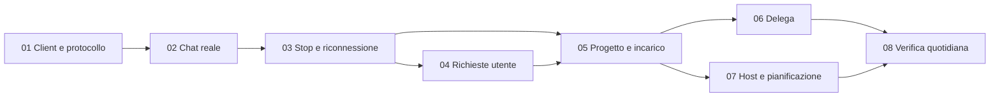

# Roadmap e gestione del progetto

2026-10-04. Stato: bozza di pianificazione di prodotto. Nessuna scadenza promessa; le stime verranno aggiornate dopo la verifica di integrazione. Il backlog è suddiviso in risultati verificabili, con un file per ticket.

## Ruoli e regole

Luca decide priorità e trade-off di prodotto; Codex cura ricerca, proposta, coordinamento, implementazione autorizzata e verifiche. Il responsabile di ciascun ticket resta riconoscibile. Usare una sola attività di implementazione in corso finché contratto e stack sono stabili; la concorrenza non è un obiettivo del progetto iniziale.

Aggiornamento continuo su file a ogni blocco significativo: stato, evidenze, decisioni e dipendenze. Un ticket è done quando passa tutti i criteri e contiene prove; una schermata o un comando avviato non bastano. Gli impedimenti riportano causa, tentativo effettuato e prossima azione.

## Milestone

| Milestone | Risultato dimostrabile | Ticket | Gate di uscita |
|---|---|---|---|
| M0 — Fondazioni | Reference, spec, design, skill e backlog consultabili | Questa fase | Documenti verificati, limiti espliciti |
| M1 — Chat affidabile | Una chat Hermes invia, riceve, si interrompe e si riapre | 01–03 | Prova runtime isolato e riconnessione |
| M2 — Controllo e incarichi | Richieste reali e responsabilità persistenti legate a progetti | 04–05 | Stato autorevole, richieste stale gestite |
| M3 — Collaborazione | Coordinatore e delegati producono un risultato tracciabile | 06 | Provenienza e interruzione coerenti |
| M4 — Continuità | Incarico pianificato avanza con client chiuso su host sempre acceso | 07 | Prova di 24 ore con evidenze |
| M5 — Uso quotidiano | Percorso verificato da Luca e accessibilità essenziale | 08 | UAT e limiti di release documentati |

M1 è la prima consegna utile. M4 dimostra il requisito 24/7; non sostituirlo con la semplice persistenza della cronologia. Voce, companion mobile e integrazioni aggiuntive sono successivi a questi gate.

## Backlog proposto e dipendenze

| ID | Risultato | Bloccato da | Complessità preliminare |
|---|---|---|---|
| 01 | Scegliere client e protocollo con evidenze | Revisione proposta, per eventuale probe eseguibile | M, alta incertezza |
| 02 | Chat reale con agente Hermes e cronologia | 01 | M |
| 03 | Interruzione e riconnessione affidabili | 02 | L |
| 04 | Approvare/rifiutare richieste senza azioni stale | 03 | M |
| 05 | Incarico persistente dentro un progetto | 03, 04 | L |
| 06 | Collaborazione minima con delegati osservabili | 05 | L |
| 07 | Pianificazione su host sempre acceso | 05 | L, dipende dall'host |
| 08 | Usabilità, accessibilità e verifica di release | 06, 07 | M |

Il ticket 07 non dipende dal 06: una pianificazione può essere provata con un solo agente. Il ticket 04 segue il 03 perché ricollegamento e interruzione determinano il ciclo di vita delle richieste. Le dimensioni sono relative, non giorni/uomo né tempi garantiti.

## Decisioni prima della prima implementazione

Rivedere spec e design, poi il risultato del confronto del ticket 01. Scegliere stack e trasporto con motivazioni. Produrre un piano dettagliato solo per il prossimo risultato, secondo il percorso skill, quindi rendere ready quel ticket. Le decisioni proposte possono cambiare senza fingere un'approvazione già ricevuta.

## Rischi e risposta concreta

| Rischio | Conseguenza | Risposta / ticket |
|---|---|---|
| UI di un nuovo client distante dalle primitive Hermes | Funzioni apparentemente disponibili ma inaffidabili | Matrice capacità e prova 01 |
| Cambiamenti del protocollo upstream | Rottura di eventi e richieste | Fissare versione, fixture e contratto 01–03 |
| Host spento o runtime riavviato | Lavoro 24/7 fermo o incerto | Stato esplicito, recupero e prova 07 |
| Retry di un invio incerto | Lavoro duplicato o effetti esterni ripetuti | Riconciliazione prima del retry 03 |
| Troppi agenti visibili | Conversazione illeggibile e costi poco chiari | Un responsabile, deleghe nei dettagli 06 |
| Permessi confusi con revisione | Azione oltre il consenso | Richieste scoped e stale gestite 04 |
| Ambito che cresce con voce/mobile/training | MVP ritardato | Backlog successivo; priorità personale/progetti |

## Checkpoint di ogni consegna

Descrivere il comportamento reso disponibile, allegare evidenze, indicare capacità non disponibili e aggiornare stato/dipendenze. Luca può correggere la direzione sui risultati concreti. Le notifiche operative future devono riguardare cambiamenti utili, non ogni heartbeat.

## Stato attuale

M0 è il risultato di questa sessione. I ticket 01–08 restano draft finché il design e la suddivisione sono rivisti. Nessun codice prodotto, deploy, account esterno o runtime personale è stato modificato.
